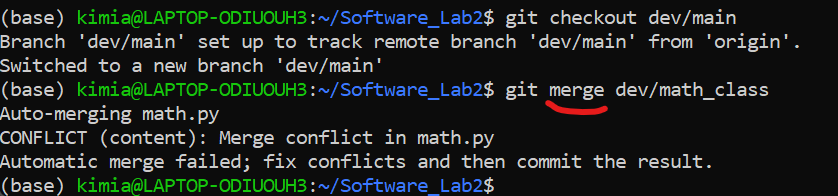
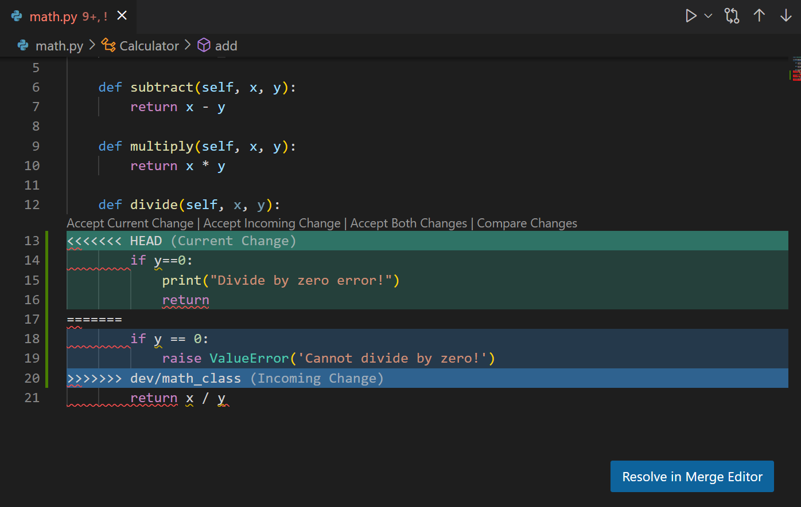
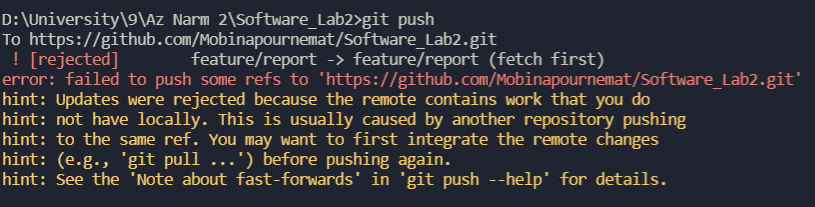
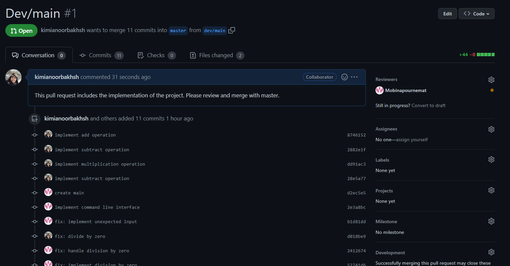

# Software_Lab2: Calculator Program
In this project we implement a simple cmd calculator program to learn how to use git and github.

# Commands and Actions
- `git clone https://github.com/Mobinapournemat/Software_Lab2.git`: clone the repository from github to local:
    

- `git add` and `git commit -m <message>`: add all files to the staging area, then commit the changes with a message:
    

- `git log`: show the commit history:
     

- `git push`: push the changes to github:
    

- `git pull`: pull the changes from github:
    

- `git branch <branch_name>` and `git checkout <branch_name>`: create a new branch and switch to it:
    
    

- `git merge <branch_name>`: merge the changes from the specified branch to the current branch:
    

- Resolving the conflict: 
    - Conflict 1: Between the two branches `dev/main` and `dev/math_class`:
    

    - Conflict 2: Between two commits on `feature/report` branch: 
    
- Creating pull request: between the bransch `dev/main` and master:
    

# Questions

<b> سوال اول</b>

مخزن Git پوشه .git/ داخل پروژه است. این مخزن تمام تغییرات ایجاد شده در فایل های پروژه شما را ردیابی می کند و در طول زمان یک تاریخچه ایجاد می کند. به این معنی که اگر پوشه .git/ را حذف کنید، تاریخچه پروژه خود را حذف می کنید.

<b> سوال دوم</b>

اتمیک بودن کامیت ها و pull request ها به این معناست که تغییرات در هر کامیت یا pull request باید کم و معنادار باشند تا مدیریت پروژه ساده تر شود، قابلیت برگشت پذیری بیشتر شود، و منشا باگ های آینده احتمالی راحت تر شناسایی شود. در واقع یک commit نشان دهنده یک تغییر اتمی واحد است، یک تغییر غیرقابل تقسیم. می تواند به طور کامل موفق شود یا می تواند به طور کامل شکست بخورد، اما نمی تواند تا حدی موفق شود. همچنین مهم است که یک Pull Request اتمی باشد. اما با یک pull request، ما "موفقیت" را به عنوان توانایی ارائه کوچکترین عملکرد ممکن اندازه گیری می کنیم، که می تواند از یک یا چند commit اتمی تشکیل شده باشد.

<b> سوال سوم</b>

دستور fetch: این دستور به مخزن محلی اطلاع می دهد که در مخزن Remote تغییراتی وجود دارد ولی تغییرات را در مخزن محلی اعمال نمی کند.

دستور merge: پس از این که تغییرات در مخزن Remote را با استفاده از دستور fetch مشاهده کردیم، برای اعمال تغییرات روی مخزن محلی می توانیم از دستور merge استفاده کنیم.

دستور Pull: این دستور برخلاف دستور fetch یک کپی از تغییراتی را که روی مخزن Remote وجود دارد را روی مخزن محلی نیز اعمال می کند. در واقع این دستور، ترکیبی از دستور fetch و سپس دستور merge است. (git pull = git fetch + git merge)

مثال: 
فایلی به نام demo.txt در داخل یک دایرکتوری در یک مخزن git مقداردهی اولیه می کنیم و تغییرات را به مخزن remote مان pull می کنیم. در این حالت فایل demo.txt را روی مخزن remote داریم و سپس مخزن محلی را نیز با آن سینک می کنیم. 
در ادامه فایل ذکر شده را در مخزن remote را آپدیت می کنیم. در این شرایط اگر از دستور fetch استفاده کنیم متوجه میشویم که تغییراتی روی مخزن remote وجود دارند که در مخزن محلی مان اعمال نشده اند. برای اینکه این تغییرات را روی مخزن محلی مان اعمال کنیم، از دستور merge استفاده می کنیم.
حالا دوباره فایل demo.txt را روی مخزن remote آپدیت می کنیم. برای اعمال تغییرات اخیر روی مخزن محلی از دستور pull استفاده می کنیم. در واقع با استفاده از دستور pull ، انگار اول دستور fetch وسپس دستور merge را در یک مرحله اجرا کرده ایم.

<b> سوال چهارم</b>

دستور rebase : فرآیند انتقال یا ترکیب دنباله ای از commit ها به یک commit پایه جدید است. Rebasing بسیار مفید است و به راحتی درfeature branching قابل مشاهده و پیگیری است. دلیل اصلی rebase، حفظ تاریخچه پروژه خطی است.

دستور clone: این دستور برای ایجاد یک کپی از یک مخزن یا branch خاص در یک مخزن استفاده می شود که تمامی اطلاعات و فایل های آن مخزن را شامل می شود. برای مثال در ابتدای کار برای مشارکت در یک پروژه از این دستور استفاده می کنیم تا یک کپی از آن مخزن در کامپیوترمان ایجاد شود و در ادامه بتوانیم تغییراتی را اعمال کنیم.

<b> سوال پنجم</b>

دستور reset: در سطح commit (جایی که کل commit ها را تغییر می دهیم)، reset کردن راهی برای انتقال نوک فعلی یک branch به یک commit قبلی است. این کار را می توان برای حذف commit هایی از شاخه فعلی که دیگر نمی خواهیم انجام داد، یا برای لغو هر تغییری که ایجاد شده است. مثالی ازاین دستور این است که branch عه new_feature را به دو کامیت قبلی (از جایی که در حال حاضر Head قرار گرفته) برگردانیم. این کار را با دستور زیر انجام میدهیم:

git checkout new-feature reset HEAD~2

دستور revert: در حالی که دستور reset باید بیشتر در شاخه های غیر public مخازن استفاده شود، مواقعی وجود دارد که می خواهیم تغییری را که در یک مخزن public ایجاد شده است، لغو کنیم. این ممکن است به این دلیل باشد که تغییرات ایجاد شده یک اشکال غیرمنتظره ایجاد کرده است یا خود تغییر مورد نیاز نبوده است. در این سناریو به جای git reset باید از git revert استفاده شود.

<b> سوال ششم</b>

منظور از stage محلی است که commit های ما پس از دستور add در آن قرار می گیرند و سپس با استفاده از دستور push تغییرات از stage به مخزن remote منتقل می شوند.

منظور از Snapshot فایل ها و فولدر های یک مخزن در یک مقطع از زمان است. در واقع یک مخزن شامل تعدادی snapshot است که در اثر commit ها به وجود آمده اند.

