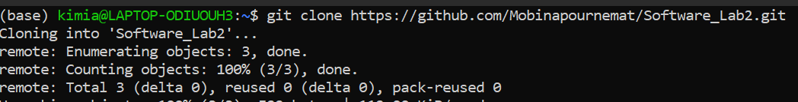
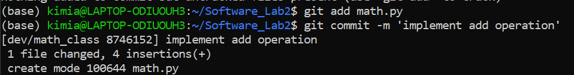
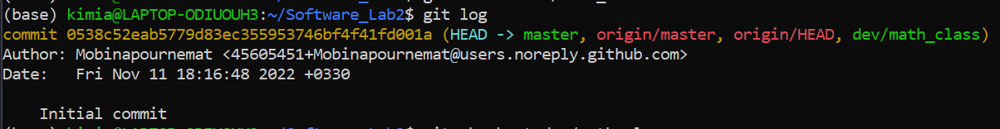
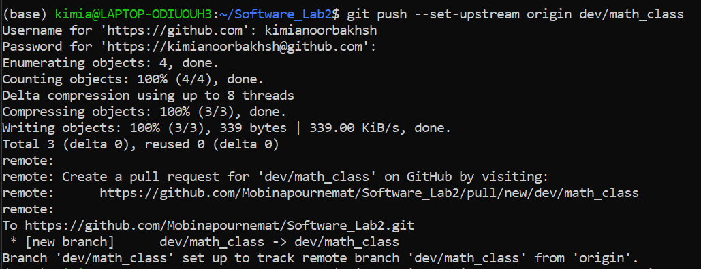
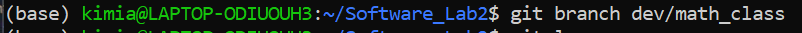
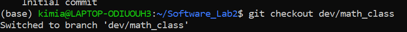

# Software_Lab2: Calculator Program
In this project we implement a simple cmd calculator program to learn how to use git and github.

# Commands
- `git clone https://github.com/Mobinapournemat/Software_Lab2.git`: clone the repository from github to local:
    

- `git add` and `git commit -m <message>`: add all files to the staging area, then commit the changes with a message:
    

- `git log`: show the commit history:
     

- `git push`: push the changes to github:
    

- `git pull`: pull the changes from github:
    

- `git branch <branch_name>` and `git checkout <branch_name>`: create a new branch and switch to it:
    
    

