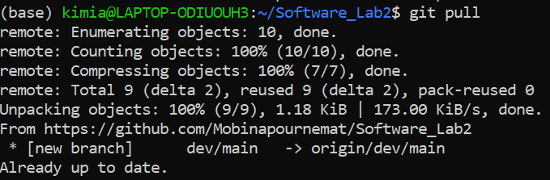

# Software_Lab2: Calculator Program
In this project we implement a simple cmd calculator program to learn how to use git and github.

# Commands and Actions
- `git clone https://github.com/Mobinapournemat/Software_Lab2.git`: clone the repository from github to local:
    

- `git add` and `git commit -m <message>`: add all files to the staging area, then commit the changes with a message:
    

- `git log`: show the commit history:
     

- `git push`: push the changes to github:
    

- `git pull`: pull the changes from github:
    

- `git branch <branch_name>` and `git checkout <branch_name>`: create a new branch and switch to it:
    
    

- `git merge <branch_name>`: merge the changes from the specified branch to the current branch:
    

- Resolving the conflict: 
    - Conflict 1: Between the two branches `dev/main` and `dev/math_class`:
    

    - Conflict 2: TBD

- Creating pull request: between the bransch `dev/main` and master:
    

